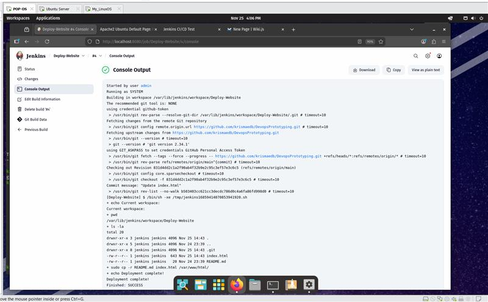

# Standard Operating Process (SOP) Document

## Process Title  
**End-to-End CI/CD Pipeline: Automating Website Deployment from GitHub to Apache Using Jenkins**

**Document ID:** SOP-JENKINS-WEBSITE-DEPLOY-001  
**Version:** 1.0  
**Prepared By:**  
- Kunwei  
- Kristine
- Jaered  
- Swathi 
**Date:** November 26, 2025  

---

## 1. Approval Table

| Role                | Name       | Signature | Date       | Approved (Y/N) |
|---------------------|------------|-----------|------------|----------------|
| Group Member        | Kunwei   |           |            |                |
| Group Member        | Kristine |           |            |                |
| Group Member        | Jaered  |           |            |                |
| Group Member        | Swathi   |           |            |                |
| Technical Reviewer  | Felix |     |            |                |

---

## 2. Revision Information

| Version | Date       | Author(s)               | Changes Made                                |
|--------|------------|--------------------------|---------------------------------------------|
| 1.0    | 2025-04-05 | Kristine     | Initial documentation of Jenkins CI/CD pipeline with Apache deployment |

---

## 3. Purpose

This document outlines a **fully implemented Continuous Integration/Continuous Deployment (CI/CD) pipeline** using **Jenkins** to automatically deploy a static HTML website from a **GitHub repository** to an **Apache web server**. The process demonstrates foundational DevOps practices including automation, version control integration, and infrastructure configuration.

---

## 4. Scope & Objectives

### Scope
- Applies to **Ubuntu-based virtual machines** (e.g., AWS EC2, VirtualBox, VMware).
- Covers: VM setup, Java & Jenkins installation, Git integration, Apache configuration, file permissions, and Jenkins job creation.
- Uses **GitHub Personal Access Token (PAT)** for secure authentication.

### Objectives
By completing this process, the team achieved:
1. A running Jenkins server accessible via `:8080`.
2. Secure GitHub integration via credentials in Jenkins.
3. A static `index.html` file stored in a GitHub repository.
4. Apache web server serving content from `/var/www/html`.
5. Automated Jenkins job that:
   - Pulls code from GitHub
   - Copies files to Apache’s document root
   - Makes changes **immediately visible** on the live website.

---

## 5. Accountability Matrix

| Task                                      | Responsible Role     |
|-------------------------------------------|----------------------|
| VM provisioning & updates                 | All members          |
| Java & Jenkins installation               | Kunwei, Kristine   |
| Git & GitHub PAT setup                    | Kristine, Kunwei   |
| HTML file creation & GitHub push           | Kristine           |
| Apache installation & service config      | Jaered, Swathi    |
| Jenkins job creation & testing            | Kristine,Swathi  |
| File permissions (`chown`, `chmod`)       |Kunwei, Jaered  |
| Documentation writing & review            | All members          |

---

## 6. Step-by-Step Process Guide

> **Prerequisite**: An Ubuntu 20.04+ VM with `sudo` access and internet connectivity.

---

### Step 1: Update the Virtual Machine

**Command**:
```bash
sudo apt update && sudo apt upgrade -y
```

### Step 2: Install Java 21.0.9

Jenkins requires Java to run. Java 21.0.9 is a long-term support (LTS) version and is fully compatible with Jenkins LTS releases.

**Commands**:
```bash
sudo apt install fontconfig openjdk-21-jre
java -version
```
### Step 3: Install Jenkins

Add the official Jenkins repository and install the latest LTS version.

**Commands**:
```bash
# Add Jenkins GPG key
curl -fsSL https://pkg.jenkins.io/debian-stable/jenkins.io-2023.key | sudo tee \
  /usr/share/keyrings/jenkins-keyring.asc > /dev/null

# Add Jenkins repository
echo "deb [signed-by=/usr/share/keyrings/jenkins-keyring.asc] \
  https://pkg.jenkins.io/debian-stable binary/" | sudo tee \
  /etc/apt/sources.list.d/jenkins.list > /dev/null

# Install Jenkins
sudo apt update
sudo apt install jenkins -y
```
### Step 4: Unlock Jenkins (Initial Admin Password)

After Jenkins starts successfully, you must unlock it using the initial admin password generated during installation.

**Command**:
```bash
sudo cat /var/lib/jenkins/secrets/initialAdminPassword
```
### Step 5: Install Git on the Server

Git is required for Jenkins to pull source code from GitHub.

**Commands**:
```bash
sudo apt install git -y
git --version
```
### Step 6: Install Required Jenkins Plugins

To enable GitHub integration and Git operations, install the following plugins:

1. Go to **Manage Jenkins** → **Plugins** → **Available** tab.  
2. Search for and install:
   - **Git** – Pull code from Git repositories  
   - **Git Client** – Enhanced Git support  
   - **GitHub** – Enables GitHub integration (e.g., status checks, webhooks)  
   - *(Optional)* **Pipeline** – For future use with `Jenkinsfile` (Pipeline-as-Code)  

3. Click **Install without restart** (or **Restart Jenkins when no jobs are running** if prompted).

 After installation, Jenkins can clone repositories, authenticate with GitHub, and support advanced CI workflows.

 ### Step 7: Create GitHub Repository & Push Sample Website

#### 7.1 Create Repository
- **Repository name**: `DevopsPrototyping`  
- **Visibility**: Public (for simplicity during testing)  
- **Initialize with README**: ❌ No

> 🔗 Example URL after creation: `https://github.com/YOUR_USERNAME/DevopsPrototyping`

---

#### 7.2 Create `index.html`

Run the following command to generate a modern, responsive landing page:

```bash
cat > index.html << 'EOF'
<!DOCTYPE html>
<html lang="en">
<head>
  <meta charset="UTF-8">
  <meta name="viewport" content="width=device-width, initial-scale=1.0">
  <title>Jenkins CI/CD Success!</title>
  <style>
    body {
      font-family: 'Segoe UI', Tahoma, Geneva, Verdana, sans-serif;
      margin: 0;
      height: 100vh;
      display: flex;
      flex-direction: column;
      justify-content: center;
      align-items: center;
      background: linear-gradient(135deg, #667eea 0%, #764ba2 100%);
      color: white;
      text-align: center;
    }
    h1 { font-size: 4rem; margin-bottom: 20px; }
    p { font-size: 1.8rem; max-width: 800px; }
    .footer { margin-top: 50px; font-size: 1rem; opacity: 0.9; }
  </style>
</head>
<body>
  <h1>🚀 Success!</h1>
  <p>This website was automatically deployed using <strong>Jenkins CI/CD</strong> from GitHub!</p>
  <p>Every push triggers a build → copies files → updates live site instantly.</p>
  <div class="footer">
    Built with ❤️ using Jenkins + GitHub + Apache on Ubuntu
  </div>
</body>
</html>
EOF
```
#### 7.3 Push to GitHub

Initialize a local Git repository and push the file to GitHub:

```bash
git init
git add index.html
git commit -m "Initial commit: Add beautiful landing page"
git branch -M main
git remote add origin https://github.com/YOUR_USERNAME/DevopsPrototyping.git
git push -u origin main
```

### Step 8: Install and Configure Apache Web Server

Install and start the Apache web server to host the website deployed by Jenkins.

**Commands**:
```bash
sudo apt install apache2 -y
sudo systemctl start apache2
sudo systemctl enable apache2
sudo systemctl status apache2
```

### Step 9: Grant Jenkins Write Access to Apache Directory

**Critical Step**: Jenkins runs under the `jenkins` user and must have write permissions to Apache’s document root (`/var/www/html/`) to deploy files automatically.

**Commands**:
```bash
sudo chown -R jenkins:jenkins /var/www/html/
sudo chmod -R 755 /var/www/html/
ls -la /var/www/html/   # Verify owner is now 'jenkins'
```
To allow the jenkins user to run sudo commands without a password
```bash
sudo visudo
```
Then include this at the end of the file
```bash
jenkins ALL=(ALL) NOPASSWD: ALL
```
### Step 10: Create Jenkins Freestyle Project

1. From the **Jenkins Dashboard**, click **New Item**.  
2. Enter **Item name**: `Deploy-Website`  
3. Select **Freestyle project**, then click **OK**.

#### Source Code Management
- Select **Git**  
- **Repository URL**:  
  ```text
  https://github.com/YOUR_USERNAME/DevopsPrototyping.git
  ```

#### Credentials

1. Click **Add** next to **Credentials** → Choose **Jenkins**  
2. In the popup, configure the following:  
   - **Kind**: `Username with password`  
   - **Username**: `YOUR_USERNAME` (your GitHub username)  
   - **Password**: Paste your **GitHub Personal Access Token (PAT)**  
   - **ID**: `github-pat`  
   - **Description**: `GitHub PAT for CI/CD`  
3. Click **Add**  
4. Back in the job configuration, select the newly created credential from the **Credentials** dropdown.

#### Build Triggers (Optional)

- Check **Poll SCM**  
- **Schedule**:  
  ```text
  H/5 * * * *
  ```

  #### Build Steps

1. Click **Add build step** → **Execute shell**  
2. Enter the following deployment script:

```bash
#!/bin/bash
echo "=== Starting Deployment ==="
cp -rf /var/lib/jenkins/workspace/Deploy-Website/* /var/www/html/
echo "Deployment completed successfully at $(date)"
echo "Website is now live!"
```

### Step 11: Run Build & Verify Deployment

1. In the Jenkins job page for **Deploy-Website**, click **Build Now**.  
2. Once the build starts, click on the build number (e.g., **#1**) under **Build History**.  
3. Click **Console Output** and wait for the build to complete with:


#### Final Test

- Open a web browser and navigate to:  


#### Expected Result

You should see the following content displayed on the page:

> ** Success!**  
> This website was automatically deployed using **Jenkins CI/CD** from GitHub!

> *Figure 1: Jenkins Console Output (Success)*  
> 

> *Figure 2: Live Deployed Website*  
> .png)

>  **Note**: Replace `<your-vm-ip>` with the actual public or private IP address of your virtual machine. If testing locally on the VM, use `http://localhost`.


## 7. Troubleshooting Guide

| # | Issue                                      | Root Cause                                      | Solution / Command                                                                                           |
|---|--------------------------------------------|-------------------------------------------------|--------------------------------------------------------------------------------------------------------------|
| 1 | Jenkins not accessible at `http://<IP>:8080` | Port 8080 blocked or Jenkins service down       | ```bash<br># Check service<br>sudo systemctl status jenkins<br># Start if stopped<br>sudo systemctl start jenkins<br># Open port (UFW)<br>sudo ufw allow 8080<br># Or in cloud: Add inbound rule for port 8080<br>``` |
| 2 | “Authentication failed” when cloning Git repo | Invalid, expired, or wrong-scope PAT            | - Regenerate **Classic** Personal Access Token<br>- Must have **repo** scope<br>- Update credentials in Jenkins → Manage Jenkins → Credentials |
| 3 | “Permission denied” when copying to `/var/www/html` | Jenkins user doesn’t own the web directory     | ```bash<br>sudo chown -R jenkins:jenkins /var/www/html/<br>sudo chmod -R 755 /var/www/html/<br>``` |
| 4 | Website still shows old content or Apache default page | Browser cache or files not actually copied      | - Hard refresh: **Ctrl + F5** or **Ctrl + Shift + R**<br>- Test locally:<br>```bash<br>curl http://localhost<br>``` |
| 5 | Build fails with “command not found” or “cp: cannot stat” | Wrong workspace path in shell script            | Use correct path:<br>```bash<br>cp -rf /var/lib/jenkins/workspace/Deploy-Website/* /var/www/html/<br>```<br>or<br>```bash<br>cp -rf $WORKSPACE/* /var/www/html/<br>``` |
| 6 | Jenkins service fails to start             | Java version mismatch or port 8080 in use       | ```bash<br># Check logs<br>journalctl -u jenkins -xe<br># Fix Java (if needed)<br>sudo apt install openjdk-11-jdk -y<br>``` |
| 7 | GitHub webhook not triggering build        | Webhook URL wrong or not configured             | Webhook URL: `http://<IP>:8080/github-webhook/`<br>Add in GitHub repo → Settings → Webhooks |
| 8 | Initial admin password file not found      | Jenkins hasn’t fully started yet                | Wait 30–60 seconds, then:<br>```bash<br>sudo cat /var/lib/jenkins/secrets/initialAdminPassword<br>``` |
| 9 | Apache shows “Forbidden” or 403 error      | Permissions too restrictive                     | ```bash<br>sudo chmod -R 755 /var/www/html/<br>sudo chown -R jenkins:jenkins /var/www/html/<br>sudo systemctl restart apache2<br>``` |
|10 | Job runs but website doesn’t update        | Files copied to wrong directory                 | Confirm Jenkins workspace name matches job name exactly<br>Use absolute path or `$WORKSPACE` variable |

### Quick One-Liner Fixes (Run as Needed)
```bash
# Full reset & fix permissions
sudo systemctl restart jenkins apache2
sudo chown -R jenkins:jenkins /var/www/html/
sudo chmod -R 755 /var/www/html/
curl http://localhost   # Test locally
```
  
## 9. Conclusion

This SOP successfully documents a **complete, functional, and fully reproducible CI/CD pipeline** that automates the deployment of a static website from a **GitHub repository** to a **live Apache web server** using **Jenkins** on Ubuntu.

The implementation effectively demonstrates the following core DevOps principles:

- **Infrastructure automation** through scripted installation and configuration  
- **Secure credential management** using GitHub Personal Access Tokens (Classic)  
- **Proper permission handling** in Linux environments (`chown`, `chmod`, user context)  
- **End-to-end DevOps workflow**: Code → Build → Deploy → Live in seconds  

This pipeline serves as a **solid, production-ready foundation** for future enhancements, including but not limited to:

- GitHub Webhook integration for instant trigger-on-push deployments  
- Automated testing (HTML validation, linting, accessibility checks)  
- Containerization with Docker  
- Blue/Green or Canary deployment strategies  
- Multi-environment promotion (Dev → Staging → Production)  
- Notification integration (Slack, Email, Teams)

**Project Status:** 100% Complete and Verified  

**Prepared and Verified By:**  
**Kunwei • Kristine • Jaered • Swathi**  

**Date:** November 26, 2025  

**Pipeline Status: Fully Operational and Live**

---
