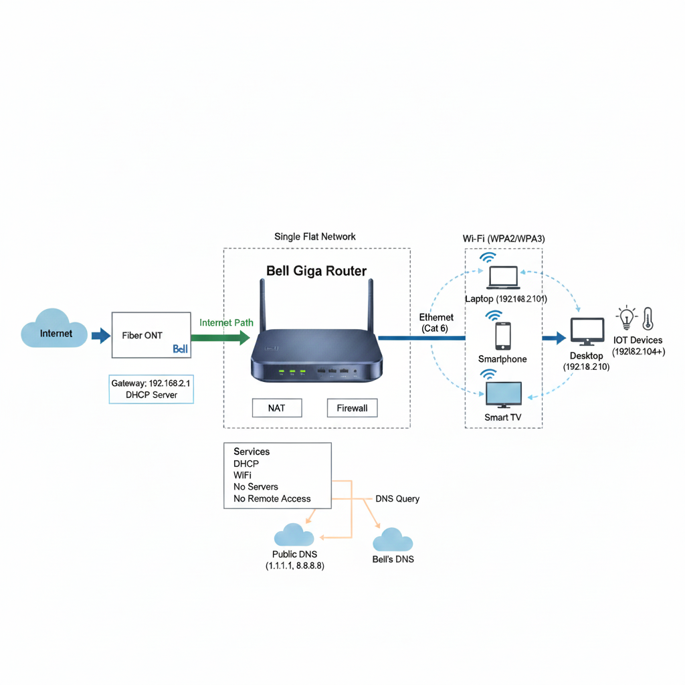

# Home Network Documentation: Georgetown Apartment

This document details the physical and logical topology of my home network in a Georgetown apartment, using Bell MTS Fiber Internet with the Bell Giga Router (Sagemcom Fast 5650). All IP addresses and device names have been anonymized for privacy.

---

## 1. Physical Topology

The physical layout of my apartment network is designed for optimal Wi-Fi coverage and minimal cable clutter. All devices are located within a single room.


### Device Locations & Connections

- **MTS Fiber ONT**: Mounted on the wall near the main electrical panel (left side of room).
- **Bell Giga Router (Sagemcom Fast 5650)**: Placed on the desk in the center of the room for central Wi-Fi distribution.
- **Wired Connection**: A **Cat 6 Ethernet cable** connects the router’s **LAN port 1** to the desktop computer.
- **Wireless Devices**: Laptop, smartphone, and smart TV connect via dual-band Wi-Fi (2.4 GHz & 5 GHz).


### Room Layout Summary
| Location          | Devices                          | Connection Type      |
|-------------------|----------------------------------|----------------------|
| Wall (Left)       | MTS Fiber ONT                    | Fiber to Router      |
| Desk (Center)     | Bell Giga Router + Desktop PC    | Ethernet (Cat 6)     |
| Couch Area        | Smartphone, Smart TV             | Wi-Fi                |
| Side Table        | Laptop                           | Wi-Fi                |

---

## 2. Logical Topology

My network operates as a **single flat subnet** with no VLAN segmentation. The Bell Giga Router handles NAT, DHCP, and firewall functions.

### Network Flow

Internet → MTS Fiber ONT → Bell Giga Router (NAT/Firewall) → Wired & Wireless Clients

### Key Logical Components
- **Subnet**: `192.168.2.0/24`
- **Gateway**: `192.168.2.1` (Bell Giga Router)
- **DHCP Range**: `192.168.2.100 – 192.168.2.200`
- **DNS Resolution**:
  - Default: Bell’s DNS servers
  - Manual override on clients: `1.1.1.1` (Cloudflare) and `8.8.8.8` (Google)
- **Security**: Built-in firewall enabled; no port forwarding or DMZ.



### Device IP Assignments (Anonymized Examples)

| Device Type       | IP Assignment | Example IP     | Notes                     |
|-------------------|---------------|----------------|---------------------------|
| Bell Giga Router  | Static        | 192.168.2.1    | Gateway, DHCP server      |
| Desktop           | Static        | 192.168.2.10   | Primary workstation       |
| Laptop            | DHCP          | 192.168.2.101  | Windows 11                |
| Smartphone        | DHCP          | 192.168.2.102  | Android                   |
| Smart TV          | DHCP          | 192.168.2.103  | Streaming only            |
| IoT Devices       | DHCP          | 192.168.2.104+ | Smart lights, thermostat  |

---

## 3. Addressing Documentation

All internal addressing follows the `192.168.2.0/24` subnet. External traffic is routed through the Bell Giga Router’s public IP (not documented here for security).

### Subnet Details
- **Network Address**: `192.168.2.0`
- **Broadcast Address**: `192.168.2.255`
- **Usable Hosts**: `192.168.2.1 – 192.168.2.254`
- **Default Gateway**: `192.168.2.1`

### DHCP Configuration
- **Lease Time**: 24 hours
- **Reserved Addresses**: None (all dynamic except desktop)
- **Option 6 (DNS)**: Provided by router (can be overridden per device)

---

## 4. Network Devices & Services

### Core Devices

#### **Bell Giga Router (Sagemcom Fast 5650)**
- Dual-band Wi-Fi 6 (2.4 GHz & 5 GHz)
- SSIDs: `BellWiFi_2G`, `BellWiFi_5G` (names altered for privacy)
- Security: WPA2/WPA3 mixed mode (AES encryption)
- Firmware: Automatically updated by Bell
- Admin Access: Local only (no remote management)
- Firewall: Enabled (stateful inspection)

#### **MTS Fiber ONT**
- Optical Network Terminal provided and managed by Bell
- No user-configurable settings
- Connects to router via fiber patch cable

### Services in Use

| Service        | Status     | Notes                                |
|----------------|------------|--------------------------------------|
| DHCP           | Enabled | Managed by Bell Giga Router          |
| Wi-Fi          | Enabled | WPA2/WPA3, AES, no guest network     |
| DNS            | Enabled | Uses Bell’s DNS or public resolvers  |
| Remote Access  | Disabled | No port forwarding or DMZ            |
| Parental Controls | Disabled | Not required                         |

---

## 5. Device Configurations

### Bell Giga Router (via 192.168.2.1 admin portal)

```plaintext
Model: Sagemcom Fast 5650
Firmware: v2.3.1 (auto-updated)
Wi-Fi:
  - 2.4 GHz: Channel 6, 20MHz bandwidth
  - 5 GHz: Channel 36, 80MHz bandwidth
  - Security: WPA2-PSK + WPA3-SAE
Firewall: Enabled (SPI)
NAT: Enabled
DHCP Server: Range 192.168.2.100–200
Port Forwarding: None
Remote Management: Disabled
```
---
## 6. Secure Credential Storage

All network credentials including the Bell Giga Router admin password and Wi-Fi passphrases are stored securely using **Bitwarden**, an open-source, end-to-end encrypted password manager. The Bitwarden vault is protected by a strong master password and two-factor authentication (via TOTP). Credentials are never saved in plaintext files, browser autofill, or written on paper. Router administrative access is restricted to the local network only, and remote management is disabled to reduce attack surface.
